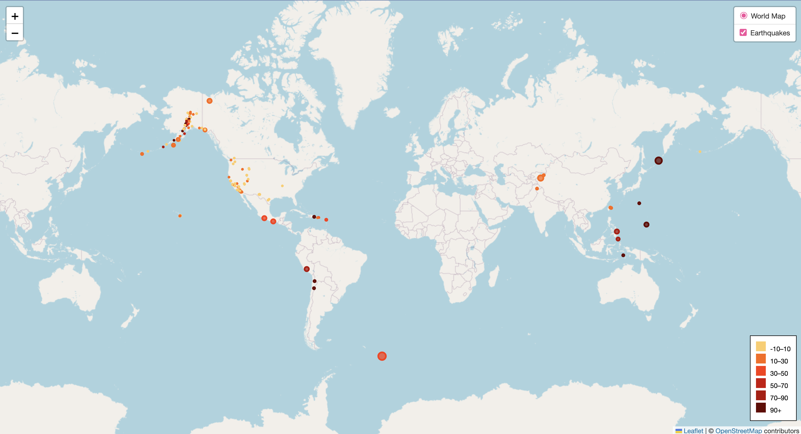
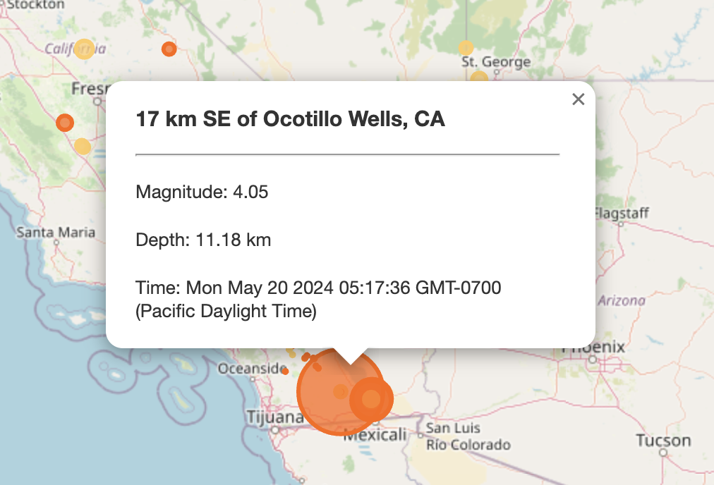

# Earthquake Visualization Map Using Leaflet
Data Source: https://earthquake.usgs.gov/earthquakes/feed/v1.0/geojson.php 
- Data selected for this project: 'All Earthquakes - Past Day' 
https://earthquake.usgs.gov/earthquakes/feed/v1.0/summary/all_day.geojson

### Map of Earthquakes
##### Marker Color = Earthquake Depth → Marker Size = Earthquake Magnitude
Hint: The depth of the earth can be found as the third coordinate for each earthquake




#### Example of Visible Earthquake Data


### Resources
* HTML Color Picker (adjusting marker colors for ranges of earthquake depth)
https://www.w3schools.com/colors/colors_picker.asp
```javascript
// Change color ranges in this block of code
    function getColor(depth) {
        return depth >= 90 ? '#660000' :
               depth >= 70 ? '#b30000' :
               depth >= 50 ? '#cc0000' :
               depth >= 30 ? '#ff3300' :
               depth >= 10 ? '#ff6600' :
               '#ffcc66';
    }
```
* Help with Legends and Styling
https://stackoverflow.com/questions/68162805/how-to-add-legend-in-leaflet-map
* Update Individual Markers Based on Conditions
https://github.com/perliedman/leaflet-realtime/issues/107
* Better Understanding Use of innerHTML in JavaScript
https://coderpad.io/blog/development/javascript-innerhtml/

#### Additional Documentation/Resources
* [Leaflet Tips & Tricks](https://leanpub.com/leaflet-tips-and-tricks/read)
* [Leaflet GeoJSON Documentation](https://leafletjs.com/reference.html#geojson)